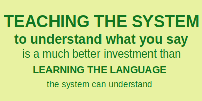
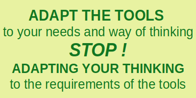

# oOo 
 
 

 
 

##	Welcome to		**oOo**		...

The FINAL GOAL of the  oOo  approach to usage of an electronic device like a computer, notebook, tablet, smarthphone, ... is to make it able to "understand" (preferably in English language formulated) requests similar to what ChatGPT is capable of when providing requested source code of applications or when delivering requested information. The  oOo  system uses the computer idle time to continously improve the speed of information access and the quality of its responses. 

The oOo approach has no clear preferences towards specific software tools or programming languages, except this ones user of this approach decided to have. In other words if you have got the right idea about the oOo approach, you would understand that any individual user will follow own individual preferences leaving the part of exchanging ideas with others to be a matter of well in English language expressed precise sentences. 

### WHAT DOES  oOo  REALLY MEAN ?

The symbol/term/word  oOo  represents an idea ... and has many different meanings depending on context with a core meaning very hard to impossible to explain using words. 

oOo  is more a personal attitude towards the way of using of a computer system you have full control about yourself than a system or a programming language or a set of guidelines and conventions it comes with. In other words  oOo  is a free of any constraints way of approaching usage of a computer system.   oOo  assumes that you are ready to spend some of your time with adapting the computer system to your way of thinking instead of spending time with adapting your way of thinking to the by the computer system natively supported languages you need to learn in order to be able to speak to the system using available user interfaces and applications.  oOo is about being ready to **take over full responsibility** of how your computer system is responding to you. In other words it's like avoiding visits to a doctor in case of own health problems after deciding that you yourself and your own behavior are responsible for the health problems you are facing and you are yourself the most competent person on Earth capable of finding out the way out from the experienced disease. 

And ...  oOo  is a nice round looking quite unique character triad expressing oOo's tendency to avoid sharp corners, straight lines and line ends ... so use it as a term/word/symbol if you like it or replace it with what **you** consider to be nice looking. Talking to a computer should be an aesthetics pleasing experience and every time a nice adventure making you happy. 

####	The Tower of Babel:
The story of the philosophy behind the   oOo   art of shaping thought processes and the related approach of creating a set of conventions for the purpose of own custom individual design of a human-computer interface begins at the Tower of Babel where God confused the languages of humanity so that they could no longer communicate with each other (Genesis 11:7). 

####	individualMetaLang:
To understand what the concept of   individualMetaLang   is about you need to know that there is something else "within" ("within" in quotation marks because there is no known physical 3D universe/world/body location you can track it down to reside there) "within" you which is more the actual you than by you percepted awareness of yourself. The actual you is capable of watching your thoughts injecting new ones into the present thought stream which then can change own emotional state and as effect of that change the course of own behavior. It is maybe fundamentaly wrong to consider 'this something else' to use a language, but it seems helpful to explain what  oOo  is about using the concept/idea of an  individualMetaLang  Meta-Language which requires translation to  individualMindLang  Mind Language enabling awareness what the own thoughts are about. For practical purposes the consideration of interaction with the outer world and electronic devices like computers it will be sufficient to start the chain of origins of an intention which needs to be communicated at the level of  individualMindLang  , the level many people believe to be the actual themselves and the origin of conscious decisions governing their behavior. Find out what you believe to be the actual you asking yourself the question: "Do I believe what I think?"
		
####	individualMindLang: 
From the point of view of   oOo   a human being is interacting with its environment using various different "build-in" and partially redundant systems with one of them being the mind using thoughts in a process called thinking with the main goal of generating useful intelligent responses to continuously ongoing changes within the human body and the far and near surrounding of it (the only thing staying the same all the time being the only still part of the Universe is the actual you at the level of    individualMetaLang   ). 
		The human mind uses chains of thoughts in the process of interpretation of incoming sensory information about the ongoing changes. These chains of thoughts can be considered to be a kind of inner language specific to each single individual. Let's give this language (which is a set of different ideas/ concepts/symbols/terms and conventions of using them in a thought process) a name:   individualMindLang   where Lang is an abbreviation of the word Language and Mind indicates the context of a brain and thinking. 
		
####	NatLang:
Let's assign to the set of tools a human uses in order to share intentions, needs, observations, memories or information about the own ongoing thought processes with other human beings a name   NatLang   meaning Natural Language. 

####	cnNatLang, deNatLang, enNatLang, ... :
The humanity developed since Babel many different languages.   oOo   uses to distinguish between them the suffix used in Internet to identify a country of origin of a domain name. So for example the context of English language is described in  oOo  using  "uk"  (and/or "us", "en"), the context of German language using "de",  the context of Chinese language using "cn", ...   .   To achieve brevity in cases of obvious context  oOo  skips mentioning the "Nat" part: cnLang, deLang, enLang or goes one step further skipping "Lang" too: cn, de, en, ...

####	prgLang:
There are plenty of different programming languages created for the purpose of programming electronic devices (like computer, notebook, cellphone, ...) . To express the context of programming an electronic device using a text based file   oOo   uses the term   prgLang   . 

####	shPrgLang, luaPrgLang, pyPrgLang, ... :
  oOo   identifies programming languages using the default file name extension used for naming of script files written in these programming languages.   shPrgLang   means for example a shell script file which commands are described by the POSIX standard, luaPrgLang means a script file written in the Lua programming language, pyPrgLang means Python as the target interpreter for the script. 
In practice each existing programming language provides functions/methods/modules which need an own specific way of usage by passing to them information formulated in a way the functions/methods/modules can process, i.e. using a specific sub-language of the programming language. This fact contributes to the "Tower of Babel" effect and may require further clarification. For example   pyPrgLangRegex   indicates a regular expression pattern supported by the Python build-in   re   module, where in order to distinguish it from a regular expression pattern supported by the external Python regex module the term   pyPrgLangRegexModule   is used. 
Different versions of same programming language may support different features using for this purpose a modified langage contributing this way to the "Tower of Babel" effect. The consequence of this is a need for further clarification of the context. In other words, the general category of being for example a   pyPrgLang   script may require further details like py2.7prgLang, py3.10prgLang, etc. 
		   
####	bashPrgLang, dashPrgLang, findPrgLang, grepPrgLang, lsPrgLang, ... :
The way how the parameter of an executable used on a command line need to be specified to be properly interpreted by the executable is considered by   oOo   to be a language specific to this executable. To clearly identify in   oOo   the executable which is the context of the "parameter-language", terms as for example   grepPrgLang   are used in which the prefix is the base name of the executable file used on the shell command line. 

Python Weekly - Issue 619 from 2023-09-28 mentions  https://github.com/zqqqqz2000/shshsh  repository on github hosting a Python module written with the purpose of being "A bridge between Python and Shell scripting"
From the perspective of  oOo  this fact is nothing else as confirmation of in modern times still existing efforts contributing to deepening of the "Tower of Babel" effect without any really useful contribution to what already exists and can be used. Developing such a module is nothing else as creation of custom language different from pyPrgLang and shPrgLang. Such kind of efforts is from the  oOo  perspective the wrong way of approaching the goal of creating one common language for all programming purposes (in this case the effort favorizes using Python language and a Python module instead of spawning directly the shell process using appropriate shell command). 
	
  oOo  focuses on creating a custom user interface system capable of "understanding" of  individualMindLang  or at least instructions given in well and clear formulated natural English language providing functionality of the interface comparable to LLM AI chat responses. 

